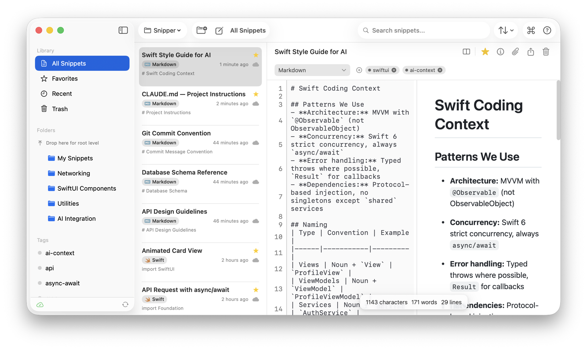

# snipper-mcp — the MCP server inside SnipperApp 3



[SnipperApp 3](https://snipperapp.com) is a native macOS code snippet manager. It ships its own [Model Context Protocol](https://modelcontextprotocol.io) server, so AI assistants can search, read, create and organise the snippets in your library. There is nothing to install: the server is a stdio binary bundled in the app.

This repository documents the server's interface. The server itself is part of the app (Swift, built on the [Swift MCP SDK](https://github.com/modelcontextprotocol/swift-sdk)).

## Requirements

- SnipperApp 3 (Mac App Store, free 7-day trial): https://apps.apple.com/us/app/snipperapp-3-code-snippets/id6757330954?mt=12
- macOS 15 or later (Apple Silicon or Intel)

## Install in Claude Desktop (one click)

Download `snipperapp-1.0.2.mcpb` from the [latest release](https://github.com/SnipperApp/snipper-mcp/releases/latest) and open it; Claude Desktop installs it as an extension. The bundle contains only a small launcher (`mcpb/server/index.js`) that finds the server inside SnipperApp 3 and hands over stdio. Without the app it still answers `initialize` and `tools/list` (the manifest in `mcpb/server/tools.json`), and every tool call returns a clear not-installed error; a `Dockerfile` runs that mode for registry introspection checks.

## Setup (manual)

Claude Code:

```bash
claude mcp add snipper -- "/Applications/SnipperApp 3.app/Contents/MacOS/snipper-mcp"
```

Claude Desktop, Cursor (`.cursor/mcp.json`), Windsurf (`~/.codeium/windsurf/mcp_config.json`):

```json
{
  "mcpServers": {
    "snipper": {
      "command": "/Applications/SnipperApp 3.app/Contents/MacOS/snipper-mcp"
    }
  }
}
```

Full guide: https://snipperapp.com/docs/mcp-integration

## Tools (25)

| Area | Tools |
|---|---|
| Snippets | `search_snippets`, `get_snippet`, `create_snippet`, `update_snippet`, `delete_snippet` |
| Folders | `list_folders`, `create_folder`, `update_folder`, `delete_folder` |
| Tags | `list_tags`, `create_tag`, `delete_tag`, `add_tag_to_snippet`, `remove_tag_from_snippet` |
| Attachments | `list_attachments`, `get_attachment`, `create_attachment`, `delete_attachment` |
| Organisation | `list_workspaces`, `list_storages`, `list_groups`, `list_languages` |
| Hub (public snippets) | `search_hub`, `get_hub_snippet`, `import_from_hub` |

Every tool carries a `title` and the MCP annotations clients use to decide what needs confirmation: the twelve read tools are marked `readOnlyHint`, the five delete/untag tools `destructiveHint`, and the three Hub tools `openWorldHint`.

The server reads and writes the same local SQLite database as the app, so anything an assistant saves appears in SnipperApp immediately. Nothing is sent to a server; the Hub tools call the public Hub API only when you use them.

## Example prompts

- "Search my snippets for the retry-with-backoff helper and paste it here."
- "Save this function as a snippet in the Work workspace, folder Utilities, tagged postgres."
- "List my Swift snippets tagged networking."

## Privacy Policy

Full policy: https://snipperapp.com/privacy

**What the server collects.** Nothing. `snipper-mcp` has no analytics, no telemetry and no crash reporting of its own. The MCPB launcher in this repository makes no network requests at all — it either hands stdio to the bundled binary or answers `tools/list` from a static file.

**How your data is used and stored.** The server reads and writes the same local SQLite database as SnipperApp 3, inside the app's own container on your Mac. Snippets, folders, tags and attachments never leave your machine unless you have turned on a sync storage yourself: iCloud (Apple CloudKit, your private database — the developer cannot read it) or GitHub Gist (your own account, under your GitHub credentials).

**Third-party sharing.** None by the server. The three Hub tools (`search_hub`, `get_hub_snippet`, `import_from_hub`) call the public SnipperApp Hub API, and only when an assistant invokes them; they send the search terms or snippet ID and nothing from your library. No snippet content is uploaded. Nothing is sold or shared with advertisers or data brokers.

**Data retention.** Your snippets live on your Mac and stay until you delete them; deleting them in SnipperApp 3 (or via `delete_snippet`) removes them from the local database and from any sync storage you enabled. There is no server-side copy for the developer to retain. Hub requests are not tied to an account and are not retained as a per-user history.

**Contact.** support@snipper.app — for questions, or to ask what is held about you and have it deleted.

## This repository

- `mcpb/` — the MCPB extension: `manifest.json`, `icon.png`, and the launcher `server/index.js`. Rebuild with `npx @anthropic-ai/mcpb pack mcpb snipperapp-<version>.mcpb`.
- `server.json` — the entry for the official MCP registry (`mcp-publisher publish`).
- The launcher and these docs are MIT licensed; SnipperApp 3 and its bundled `snipper-mcp` binary are proprietary.

## Support

support@snipper.app — bug reports, feature requests and privacy questions. Documentation: https://snipperapp.com/docs/mcp-integration
